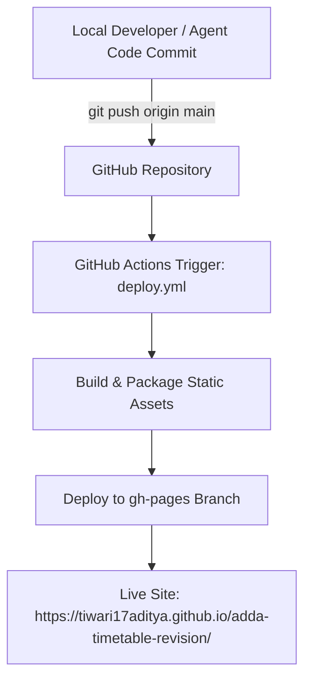

# Technology Stack & Architecture Reference

## TARGET AIR 10: Banking Exam 2026 Mock Test Tracker & Strategy Suite

A high-performance, single-page web application (SPA) built for tracking **399 test papers** across **20 mock test categories** and the **IBPS PO Aug 2 - Aug 22 Daily Strategy Routine**, backed by a cloud serverless database and automated GitHub deployment.

---

## 🛠️ Complete Technology Stack

| Layer | Technology | Purpose / Description |
|---|---|---|
| **Frontend Core** | HTML5 (Semantic) | Single-page application structure with tab-based navigation and view routing |
| **Logic & State** | Vanilla JavaScript (ES6+) | Modern async/await state management (`appState`), real-time metric calculators, DOM renderers |
| **Data Visualization**| SVG Vector Engine | Custom lightweight SVG graph renderer for score & percentile trend lines |
| **Styling & Design** | Vanilla CSS3 Variables | HSL tokenized color palette, dark-mode glassmorphism, responsive grid & flexbox layouts |
| **Typography** | Google Fonts | `Outfit` (Headings) & `Plus Jakarta Sans` (Body text) |
| **Icons** | FontAwesome 6.4.0 | Vector icons for cards, navigation, badges, and metrics |
| **Cloud Database** | **Neon Serverless Postgres** | PostgreSQL database (`ep-crimson-forest-ayk2jth0.c-5.us-east-2.aws.neon.tech`) connected via Neon HTTP API |
| **Offline Storage** | HTML5 LocalStorage | Client-side fallback database (`air10_mocks_v2`, `air10_ibps_checked`) for instant load |
| **Data Backup** | JSON Serialization | Native JSON export/import tool for user backup portability |
| **Version Control** | Git | Distributed version control with `main` and `gh-pages` branches |
| **Source Repository** | GitHub | Host repo: [https://github.com/tiwari17aditya/adda-timetable-revision](https://github.com/tiwari17aditya/adda-timetable-revision) |
| **CI/CD Pipeline** | GitHub Actions | Deployment workflow ([.github/workflows/deploy.yml](file:///d:/Antigravity-Projects/adda-timetable-revision/.github/workflows/deploy.yml)) |
| **Web Hosting** | GitHub Pages | Live web hosting: [https://tiwari17aditya.github.io/adda-timetable-revision/](https://tiwari17aditya.github.io/adda-timetable-revision/) |
| **Agent Skill Rules**| AGENTS.md & SKILLS | Custom AI Agent rules ([.agents/AGENTS.md](file:///d:/Antigravity-Projects/adda-timetable-revision/.agents/AGENTS.md) and [.agents/skills/mock-tracker-optimization/SKILL.md](file:///d:/Antigravity-Projects/adda-timetable-revision/.agents/skills/mock-tracker-optimization/SKILL.md)) |

---

## 🗄️ Database Architecture (Neon Postgres)

The application communicates directly with Neon Serverless Postgres via HTTPS using Neon's HTTP SQL query driver.

### Database Schema Definitions

#### 1. `adda_mock_logs` Table (Mock Test Attempt Records)
```sql
CREATE TABLE IF NOT EXISTS adda_mock_logs (
    id TEXT PRIMARY KEY,
    category_id TEXT NOT NULL,
    paper_num INTEGER NOT NULL,
    date TEXT NOT NULL,
    source TEXT NOT NULL,
    duration NUMERIC,
    total_qs NUMERIC,
    total_marks NUMERIC,
    attempted NUMERIC,
    correct NUMERIC,
    wrong NUMERIC,
    score NUMERIC,
    percentile NUMERIC,
    cutoff NUMERIC,
    weaknesses TEXT,
    accuracy NUMERIC,
    score_pct NUMERIC,
    unattempted NUMERIC,
    speed NUMERIC,
    created_at TIMESTAMP WITH TIME ZONE DEFAULT NOW()
);
```

#### 2. `adda_ibps_checked` Table (IBPS PO Daily Strategy Routine Checkboxes)
```sql
CREATE TABLE IF NOT EXISTS adda_ibps_checked (
    id TEXT PRIMARY KEY,
    checked BOOLEAN DEFAULT FALSE,
    updated_at TIMESTAMP WITH TIME ZONE DEFAULT NOW()
);
```

---

## 📁 Repository Directory Structure

```
adda-timetable-revision/
├── .agents/
│   ├── AGENTS.md                                # Agent directives & token optimization rules
│   └── skills/
│       └── mock-tracker-optimization/
│           └── SKILL.md                         # Mock tracker catalog & calculation specifications
├── .github/
│   └── workflows/
│       └── deploy.yml                           # GitHub Actions automated deployment workflow
├── IBPS_PO_Detailed_Daily_Tracker.pdf           # Original IBPS PO Strategy PDF tracker
├── TECH_STACK.md                                # Technology stack documentation
├── schema.sql                                   # Neon Postgres SQL DDL script
├── index.html                                   # Core application HTML single-page view
├── app.js                                       # Application business logic & database adapter
├── styles.css                                  # Custom dark-mode glassmorphism design system
└── timetable_data.json                          # Supplementary timetable data reference
```

---

## 🚀 Deployment & CI/CD Flow


